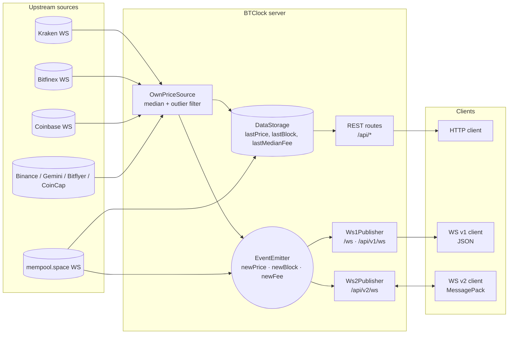
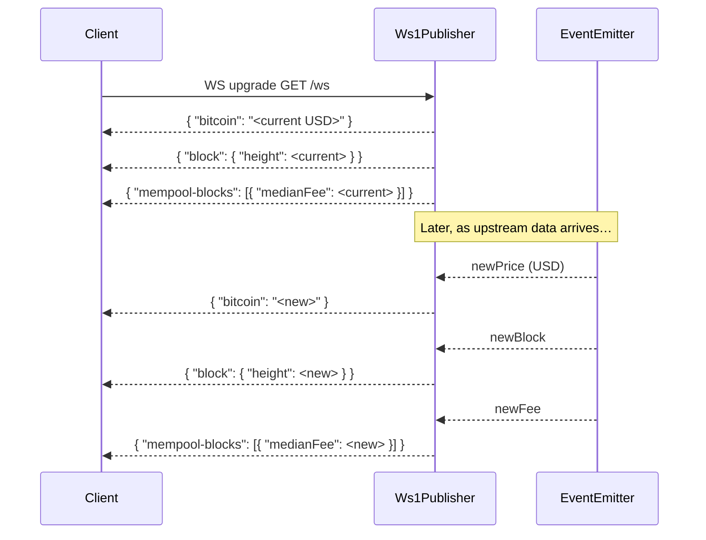
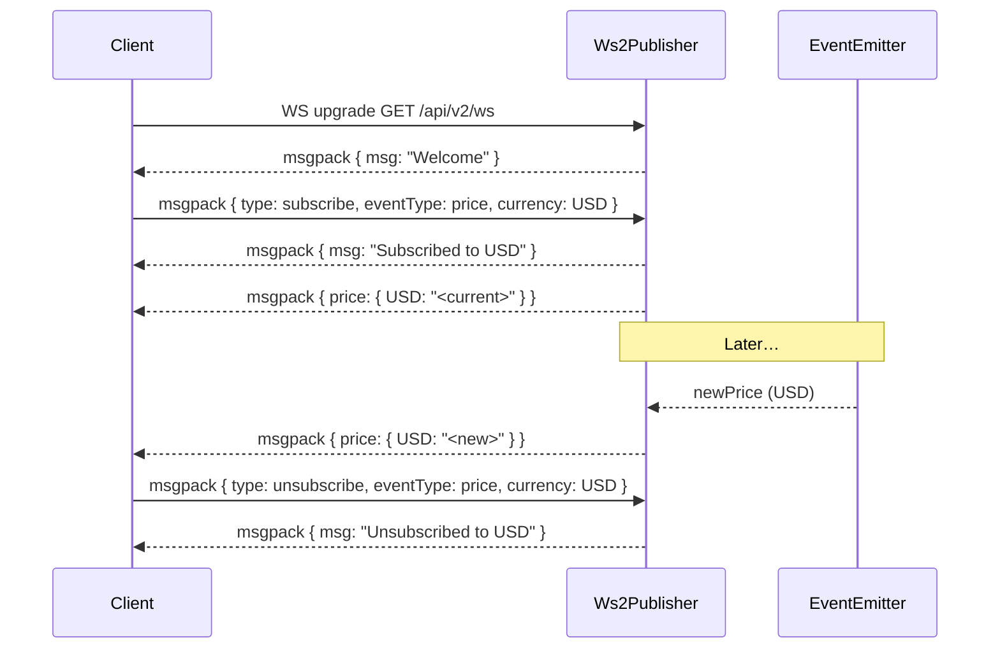
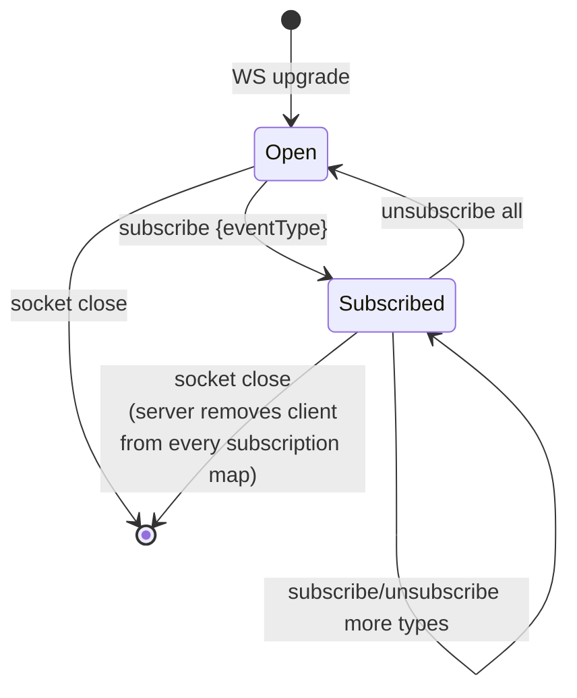

# BTClock WS data source — API reference

This server exposes three things:

- **REST endpoints** under `/api/*` for pulling the latest aggregated BTC price, block height, and median mempool fee.
- **Legacy WebSocket v1** at `/ws` and `/api/v1/ws`: JSON frames, broadcast to every connected client.
- **WebSocket v2** at `/api/v2/ws`: MessagePack frames, subscription-based.

Interactive playgrounds and machine-readable specs:

| Artifact | Where | Notes |
| --- | --- | --- |
| OpenAPI 3.1 (REST) | [`/openapi.json`](http://localhost:8080/openapi.json) | Generated from route schemas in [server/app.ts](../server/app.ts). |
| Scalar API reference | [`/docs`](http://localhost:8080/docs) | Interactive REST playground. |
| AsyncAPI 2.6 (WebSockets) | [`docs/asyncapi.yaml`](./asyncapi.yaml) | Paste into [studio.asyncapi.com](https://studio.asyncapi.com) for an interactive view. |

> **Note:** `/docs` and `/openapi.json` are only mounted when `NODE_ENV !== 'production'`. In production both routes return 404.

## Architecture



## REST endpoints

Full schemas, examples, and a live "Try it" client live in Scalar at [`/docs`](http://localhost:8080/docs). Short index:

| Method | Path | Summary |
| --- | --- | --- |
| GET | `/api/lastblock` | Latest block height. |
| GET | `/api/lastprice` | Map of currency → latest BTC price string. |
| GET | `/api/lastfee` | Latest median mempool fee (sats/vB, decimal). |
| GET | `/api/v2/currencies` | List of supported currency codes. |
| GET | `/api/hostname` | OS hostname of the server process. |
| GET | `/api/debugprice` | Per-exchange raw prices (before aggregation). |
| GET | `/api/debugupdates` | Per-exchange last-update timestamps (ms). |

All endpoints are unauthenticated and return `application/json`.

## WebSocket v1 — legacy JSON broadcast

**Endpoints:** `/ws`, `/api/v1/ws` (aliases).
**Encoding:** UTF-8 JSON text frames.
**Direction:** server → client only. Inbound messages are ignored.

On connect the server immediately emits three frames with the current state, then pushes deltas.

### Frames

```jsonc
// USD price (only emitted when the value changes by >2 sats)
{ "bitcoin": "64211.53" }

// New confirmed block
{ "block": { "height": 870123 } }

// Median next-block fee (rounded; emitted only when the rounded value changes)
{ "mempool-blocks": [{ "medianFee": 13 }] }
```

### Connect sequence



## WebSocket v2 — MessagePack subscriptions

**Endpoint:** `/api/v2/ws`.
**Encoding:** [MessagePack](https://msgpack.org) binary frames (both directions).
**Direction:** bidirectional. Clients must subscribe before receiving data.

### Client → server

```jsonc
// Subscribe — eventType ∈ { blockheight, blockfee, blockfee2, price }
{ "type": "subscribe", "eventType": "blockheight" }
{ "type": "subscribe", "eventType": "price", "currency": "USD" }
{ "type": "subscribe", "eventType": "price", "currencies": ["USD", "EUR"] }

// Unsubscribe — same shape, same eventType values
{ "type": "unsubscribe", "eventType": "price", "currency": "USD" }
```

`blockfee` is integer-rounded and only fires when the rounded value changes. `blockfee2` is a 2-decimal value that fires on every upstream fee tick.

### Server → client

```jsonc
{ "msg": "Welcome" }                 // once, on connect
{ "msg": "Subscribed to USD" }       // ack
{ "msg": "Unsubscribed to USD" }     // ack
{ "error": "GBP does not exist." }   // on bad currency
{ "blockheight": 870123 }
{ "blockfee":   13 }
{ "blockfee2":  12.75 }
{ "price": { "USD": "64211.53" } }
```

### Subscribe sequence



### Connection lifecycle



## Behavioural notes

- **Price dedup.** The aggregator emits `newPrice` only when the new median differs from the last published value **and** the absolute delta exceeds 2 sats. This is why a quiet market produces no frames.
- **Fee dedup (v1 and `blockfee`).** Only emitted when `Math.round(medianFee)` changes. `blockfee2` bypasses this and reflects every upstream tick.
- **Outlier filter.** `OwnPriceSource` drops exchange prices more than 50σ from the per-currency mean before taking the median. Use [`/api/debugprice`](http://localhost:8080/api/debugprice) to inspect what upstream is sending.
- **Mempool reconnect.** If the upstream `mempool.space` WebSocket drops, the server reconnects after 1 s. No client action is needed — the v1/v2 publishers keep the existing client sockets open.
- **No auth.** Every endpoint and socket is public. Put a reverse proxy in front if you need access control.
